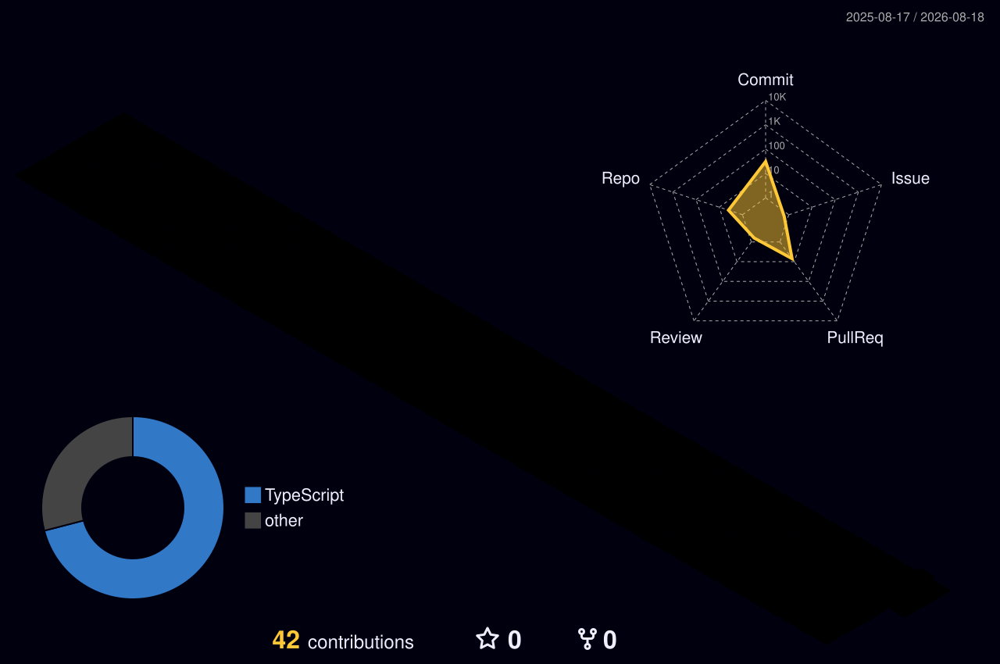

<div align="center">

  <!-- Dynamic Cyber Spider / Coding Typing SVG Banner -->
  <a href="https://github.com/techhandoo">
    
  </a>

  <p align="center">
    <code>🕷️ [SPIDER-PROTOCOL ONLINE] // WEAVING DISTRIBUTED NETWORKS & AI AGENT ARCHITECTURES</code>
  </p>

  <!-- Live Hacker/Spider Badges -->
  <p align="center">
    <a href="https://github.com/techhandoo">
      
    </a>
    <a href="https://github.com/techhandoo?tab=repositories">
      
    </a>
    <a href="https://linkedin.com/in/krrish-handoo">
      
    </a>
  </p>

  <!-- Developer Quick Connect Dock -->
  <p align="center">
    <a href="https://linkedin.com/in/krrish-handoo" target="_blank">
      
    </a>
    <a href="mailto:krrishhandoo@gmail.com">
      
    </a>
    <a href="https://proj-resume-intelligence.vercel.app/" target="_blank">
      
    </a>
    <a href="https://github.com/techhandoo">
      
    </a>
  </p>

  
</div>

<br/>

<!-- Terminal Window Showcase -->
## 🕷️ `$ cat /etc/developer/spider_protocol.ts`

```typescript
interface SpiderDeveloper {
  alias: string;
  handle: string;
  role: string;
  coreWeb: string[];
  architecturePatterns: string[];
  aiTooling: string[];
  philosophy: string;
}

const krrish: SpiderDeveloper = {
  alias: "Krrish Handoo",
  handle: "@techhandoo",
  role: "Full Stack & AI Software Engineer",
  coreWeb: ["TypeScript", "React", "Java (Spring Boot)", "Python", "RabbitMQ"],
  architecturePatterns: [
    "Event-Driven Microservices",
    "High-Throughput Asynchronous Ingestion",
    "RESTful API Design",
    "Role-Based Access Control (RBAC)"
  ],
  aiTooling: ["Groq LLM Ultra-Fast Inference", "Claude Code Agentic Workflows", "NLP Tokenization"],
  philosophy: "Weave resilient digital webs that effortlessly scale under massive traffic."
};

// Continuous Execution Loop
while (krrish.isAlive()) {
  krrish.senseWebEvents();
  krrish.solveComplexAlgorithms();
  krrish.deployToCloud();
}
```

---

## ⚡ Tech Stack & Developer Matrix

<div align="center">

### `>_` Core Programming Languages
<a href="https://skillicons.dev">
  
</a>

<br/>

### `>_` Frontend & UI Systems
<a href="https://skillicons.dev">
  
</a>

<br/>

### `>_` Backend, Microservices & Messaging
<a href="https://skillicons.dev">
  
</a>

<br/>

### `>_` AI, LLMs & Autonomous Workflows
<p align="center">
  
  
  
  
</p>

<br/>

### `>_` Databases, Infrastructure & Tooling
<a href="https://skillicons.dev">
  
</a>

</div>

<br/>

---

## 🚀 Featured Repositories & Architecture Deep Dives

<details open>
<summary><strong>🌟 AI-Powered Resume Intelligence Platform</strong> (<code>proj-resume-intelligence</code>)</summary>
<br/>

```bash
$ git clone https://github.com/techhandoo/proj-resume-intelligence.git
$ cd proj-resume-intelligence && npm run dev
```

> **Enterprise-grade candidate screening & unstructured resume data extraction engine.**

- **Asynchronous Pipeline**: Built with React (TypeScript) on the frontend and Spring Boot microservices connected via RabbitMQ queues for non-blocking candidate ingestion.
- **Ultra-Fast LLM Inference**: Integrated with Groq LLM API to extract and categorize candidate skills, experience, and match scoring within milliseconds.
- 🔗 **Links**: [Live Application](https://proj-resume-intelligence.vercel.app/) • [GitHub Repo](https://github.com/techhandoo/proj-resume-intelligence)
- 🛠️ **Tech**: `React` `TypeScript` `Spring Boot` `RabbitMQ` `Groq API` `TailwindCSS` `Vercel`

</details>

<details>
<summary><strong>🤖 AI Job Search & Application Agent</strong> (<code>ai-job-search</code>)</summary>
<br/>

```bash
$ git clone https://github.com/techhandoo/ai-job-search.git
$ cd ai-job-search && claude
```

> **Local machine-native AI job search & application automation framework built on Claude Code.**

- **Autonomous Agent**: Scrapes and parses raw job descriptions, extracts core tech keywords, synthesizes tailored resumes/cover letters, and generates interview simulation briefs.
- **Machine-Native**: Operates locally with full data ownership and customizable agent personas.
- 🔗 **Links**: [GitHub Repo](https://github.com/techhandoo/ai-job-search)
- 🛠️ **Tech**: `Claude Code` `AI Agents` `Python` `Node.js` `Automation`

</details>

<details>
<summary><strong>🗳️ Enterprise eVoting Full Stack Platform</strong> (<code>VOTING_NEW</code>)</summary>
<br/>

```bash
$ mvn clean install
$ java -jar target/evoting-platform.jar
```

> **Complete end-to-end electronic voting platform with secure role-based identity validation.**

- **Backend Architecture**: Java-driven enterprise voting engine featuring encrypted ballot submissions, administrative analytics, and audit logging.
- **Optimization**: Resolved database concurrency bottlenecks and modernized client verification controllers.
- 🔗 **Links**: [GitHub Repo](https://github.com/techhandoo/VOTING_NEW)
- 🛠️ **Tech**: `Java` `Spring` `Servlets` `JSP/HTML5` `MySQL` `RESTful APIs`

</details>

<details>
<summary><strong>🗺️ Interactive Profile Mapper & Geo-Analytics</strong> (<code>profile-map-app</code>)</summary>
<br/>

```bash
$ cd profile-map-app && npm start
```

> **Geospatial interactive mapping dashboard featuring responsive coordinate clustering.**

- **Features**: Interactive vector markers, responsive boundary calculations, and client-side geospatial search filtering.
- 🔗 **Links**: [GitHub Repo](https://github.com/techhandoo/profile-map-app)
- 🛠️ **Tech**: `JavaScript` `Map APIs` `HTML5/CSS3` `Modern UI`

</details>

<details>
<summary><strong>📈 Python Text Analysis & Data Telemetry Suite</strong> (<code>text-analysis</code> / <code>expense-tracker</code>)</summary>
<br/>

```bash
$ python3 -m venv venv && source venv/bin/activate
$ python3 main.py --analyze
```

> **NLP sentiment/frequency tokenization engine & automated personal telemetry trackers.**

- **Features**: Token frequency analysis, lexical density scoring, and structured data serialization.
- 🔗 **Links**: [text-analysis Repo](https://github.com/techhandoo/text-analysis) • [expense-tracker Repo](https://github.com/techhandoo/expense-tracker)
- 🛠️ **Tech**: `Python 3` `NLP Algorithms` `Data Analysis` `Clean CLI`

</details>

<br/>

---

## 📊 Real-Time GitHub Analytics & Contribution Flow

<div align="center">

  <!-- Interactive Activity Graph -->
  <a href="https://github.com/techhandoo">
    
  </a>

  <br/><br/>

  <!-- Stats Grid -->
  <table align="center" border="0">
    <tr>
      <td align="center" width="50%">
        <a href="https://github.com/techhandoo">
          
        </a>
      </td>
      <td align="center" width="50%">
        <a href="https://github.com/techhandoo">
          
        </a>
      </td>
    </tr>
    <tr>
      <td colspan="2" align="center">
        <a href="https://github.com/techhandoo">
          
        </a>
      </td>
    </tr>
  </table>

</div>

<br/>

---

## 🕷️ 3D Cyber-Spider Contribution Grid

<p align="center">
  
</p>

<br/>

---

## 💬 Developer Mindset

<div align="center">
  <a href="https://github.com/techhandoo">
    
  </a>
</div>

<br/>

---

## 🌐 Initialize Connection

<div align="center">

```bash
$ ping -c 1 spider.handoo.dev
64 bytes from techhandoo: icmp_seq=1 ttl=64 time=0.042 ms
--- spider-web connection established: ready to build awesome software ---
```

  <p>Always open to discussing microservice architectures, intelligent agent workflows, and innovative engineering challenges.</p>

  <a href="https://linkedin.com/in/krrish-handoo">
    
  </a>
  &nbsp;
  <a href="mailto:krrishhandoo@gmail.com">
    
  </a>
  &nbsp;
  <a href="https://proj-resume-intelligence.vercel.app/">
    
  </a>

  <br/><br/>

  <p align="center">
    <i><code>Built with 🕷️ & 💻 by <b>Krrish Handoo</b> (@techhandoo)</code></i>
  </p>

  

</div>
